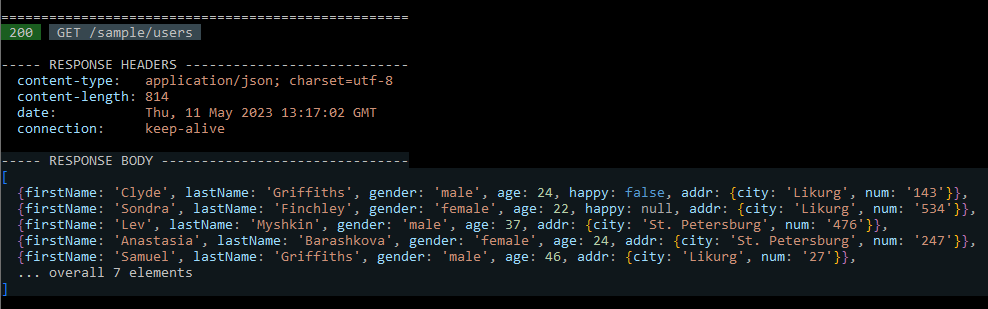
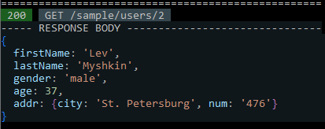
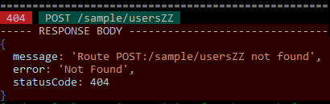

# print-response

Print beautified Fastify inject-response in terminal: app.inject(opts).then(printResponse). Color indication of http-status and http-method, brief representation of massive body, optional headers output.

`app.inject({ method: 'GET', url: 'sample/users' }).then(response => {printResponse(response, {showHeaders: true})})`



`app.inject({ method: 'GET', url: 'sample/users/2' }).then(printResponse)`


`app.inject({ method: 'GET', url: 'sample/usersZZ' }).then(printResponse)`


## Usage

```javascript
import app from "./fapp";
import printResponse from 'print-response';


```
